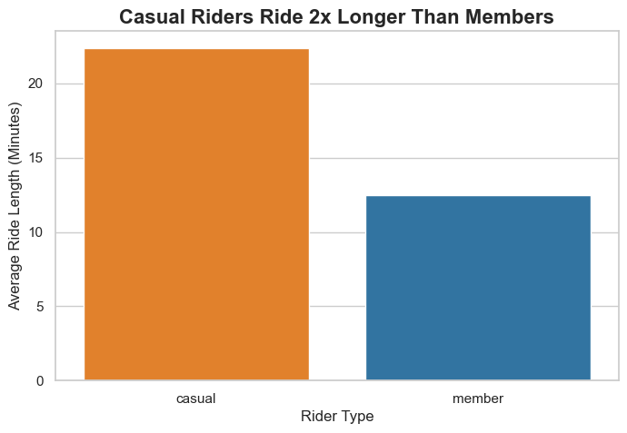
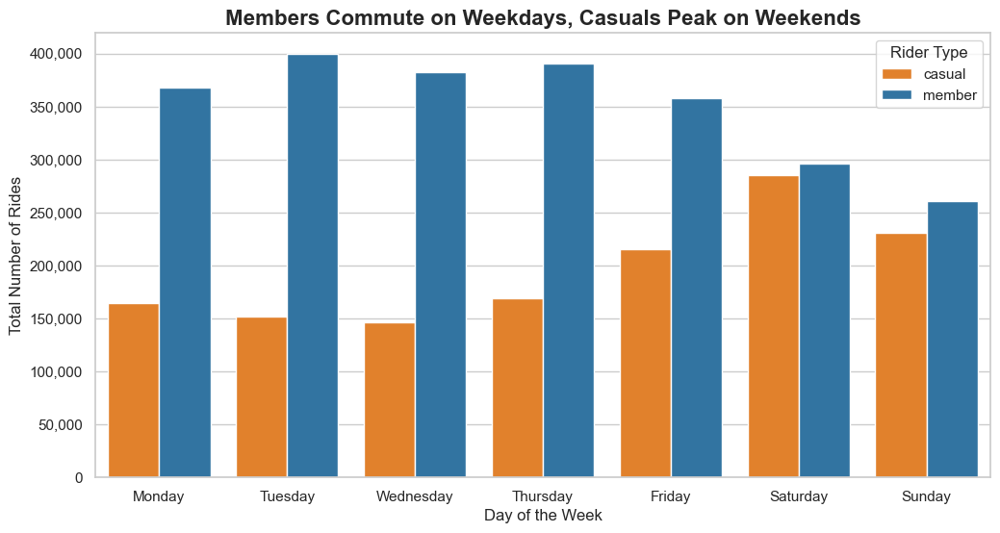
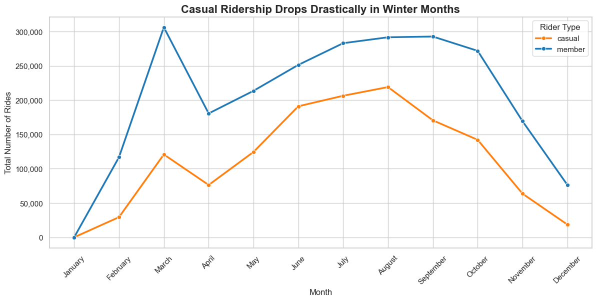

# Cyclistic Bike-Share Data Analysis

## Business Task
Analyze historical bike trip data to identify trends in how annual members and casual riders use Cyclistic bikes differently, in order to guide a targeted marketing strategy to convert casuals into annual members.

## Tools Used
* **Python (Pandas, Matplotlib, Seaborn):** Used for cleaning, transforming, and visualizing over 5 million rows of data.
* **Jupyter Notebook:** Used as the primary IDE for analysis.

## Data Cleaning & Manipulation
* Combined 12 months of CSV data into a single dataframe.
* Extracted day of the week and ride duration from timestamp columns.
* Removed null values, negative trip durations, and duplicate IDs to ensure data integrity.

## Key Visualizations & Insights

* **Insight 1:** Casual riders ride 2x longer than members.
* **Insight 2:** Member ridership peaks on weekdays (commuting), while casual ridership peaks on weekends (leisure).

## Strategic Recommendations
1. Launch a "Weekend-Only" membership.
2. Focus marketing budget on the peak Summer months.
3. Offer extended ride durations as a premium perk for members.

## Expanded Strategic Marketing Plan

Based on geospatial analysis of the Top 10 Casual Rider stations, the digital marketing strategy should include:

* **Geofenced Ads:** Target digital ads near high-traffic leisure stations (e.g., Streeter Dr & Grand Ave).
* **Timing-Based Notifications:** Push app notifications on Thursday evenings to capture weekend riders.
* **Cost-Savings Angle:** Emphasize how the flat annual fee saves money for long 45+ minute rides.

## Future Next Steps
To further expand on this analysis, Cyclistic should gather exact pricing/transaction data to calculate ROI, weather data to correlate with seasonal dips, and user surveys to understand qualitative purchase hesitations.
